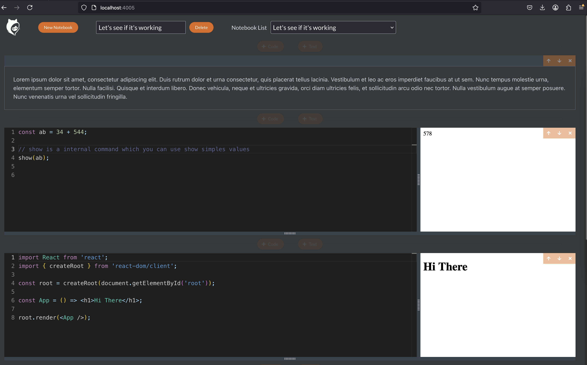

This is a course I followed from [udemy](https://www.udemy.com/course/react-and-typescript-build-a-portfolio-project/)

I extended the application and update some packages, for example, the original used "create react app" which is deprecated. In my project I use vite. The original only save one notebook, I have added the ability to save more than one. 

Where you can build an notebook app where you can execute js snippets online in your browser like codepen and add markdown notes and group them into a file. 

The notebooks are saved in your machine in a file using express and node.

The technology used are node, express, react and lerna to manipulate them as a monorepos and publish them into npm packages

There are three projects:

* cli, where via line command, we can invoke the web app (via local-api) and indicate the parameters that will used to create the files json to save the information.

* local-api, where via express, we invoke the react web app. When it's invoke in dev environment, we use a proxy middleware to the react app which is running via vite. Othercase, use static files of the react app build. And via routes, creates the json flles to save the data.

* local-client, it's the react web app.

Three ways to execute this project

## Execute it via npm packages

The package is located on [https://www.npmjs.com/package/notebook-app-inline-markdown-jscode-snippets](https://www.npmjs.com/package/notebook-app-inline-markdown-jscode-snippets)


```shell

# using npx

$ npx notebook-app-inline-markdown-jscode-snippets@latest serve

Opened "file-list-notebooks-workbook.json".

 Navigate to:

http://localhost:4005/

 to edit the file.

In this folder, the app will create some json files, one it's the list of the notebooks and the other is the notebook code/text

```

## Install via npm

```shell
$ sudo npm install -g notebook-app-inline-markdown-jscode-snippets@latest

added 306 packages in 4s

139 packages are looking for funding
  run `npm fund` for details
❯ npx notebook-app-inline-markdown-jscode-snippets
Usage: notebook-app-inline-markdown-jscode-snippets [options] [command]

Options:
  -h, --help                  display help for command

Commands:
  serve [options] [filename]  Open a file for editing
  help [command]              display help for command
$ notebook-app-inline-markdown-jscode-snippets serve

Opened "file-list-notebooks-workbook.json".

 Navigate to:

http://localhost:4005/

 to edit the file.

In this folder, the app will create some json files, one it's the list of the notebooks and the other is the notebook code/text

```

## Download from my own github

clone or download this repository in your machine,
the structure project is the following:

``` 
$ tree -L 2
.
├── lerna-debug.log
├── lerna.json
├── package-lock.json
├── package.json
├── packages
│   ├── cli
│   ├── local-api
│   ├── local-client
├── readme-about-lerna.md
├── readme.md
├── screenshot.png

```

You need to install the packages and open two terminals to execute 

```shell
# install the packages
$ npm install 
```


### 1st terminal
```shell
# in the main folder, execute
$ npm run start

> start
> lerna run start --parallel

lerna notice cli v8.2.0

 Lerna (powered by Nx)   Running target start for 3 projects:

- notebook-app-inline-markdown-jscode-snippets
- @notebook-app-inline-markdown-jscode-snippets/local-api
- @notebook-app-inline-markdown-jscode-snippets/local-client


> @notebook-app-inline-markdown-jscode-snippets/local-client:start


> @notebook-app-inline-markdown-jscode-snippets/local-api:start


> notebook-app-inline-markdown-jscode-snippets:start

> @notebook-app-inline-markdown-jscode-snippets/local-client@3.0.4 start
> vite
> notebook-app-inline-markdown-jscode-snippets@3.0.4 start
> tsc --watch --preserveWatchOutput
> @notebook-app-inline-markdown-jscode-snippets/local-api@3.0.4 start
> tsc --watch --preserveWatchOutput
2:24:49 PM - Starting compilation in watch mode...
2:24:49 PM - Starting compilation in watch mode...
✘ vite v6.1.0 is not yet supported in the Community edition of Console Ninja.
We are working hard on it for you https://tinyurl.com/3h9mtwra.
Estimated release dates:
  - Community users: around 4th April, 2025 (subject to team availability)
  - PRO users:       priority access is available now
2:24:50 PM [vite] (client) Re-optimizing dependencies because lockfile has changed
  VITE v6.1.0  ready in 274 ms
  ➜  Local:   http://localhost:5173/
  ➜  Network: use --host to expose
  ➜  press h + enter to show help
2:24:50 PM - Found 0 errors. Watching for file changes.
2:24:50 PM - Found 0 errors. Watching for file changes.
```


### 2nd terminal
```shell
$ cd packages/cli/dist
$ node index.js serve

Opened "file-list-notebooks-workbook.json".

 Navigate to:

http://localhost:4005/

 to edit the file.

In this folder, the app will create some json files, one it's the list of the notebooks and the other is the notebook code/text

```

---

This is the app in your browser:



---

Note:

If you review the project, you will notice that there are some files with extension like ts.txt, etc. It's because during the course, those files are modified and I don't want to lost the previous change to compare later.